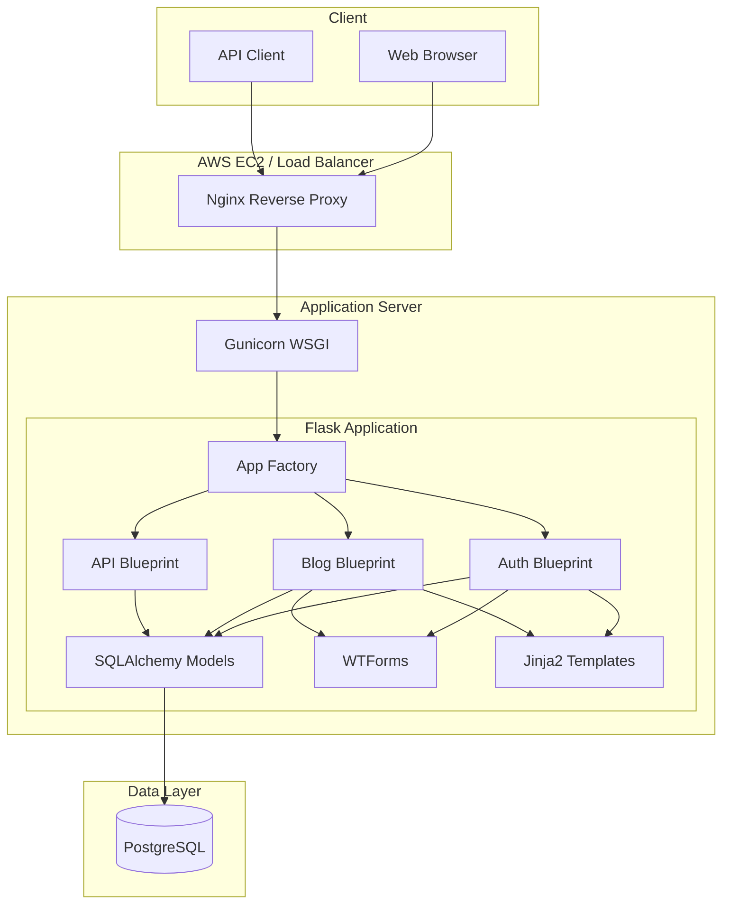
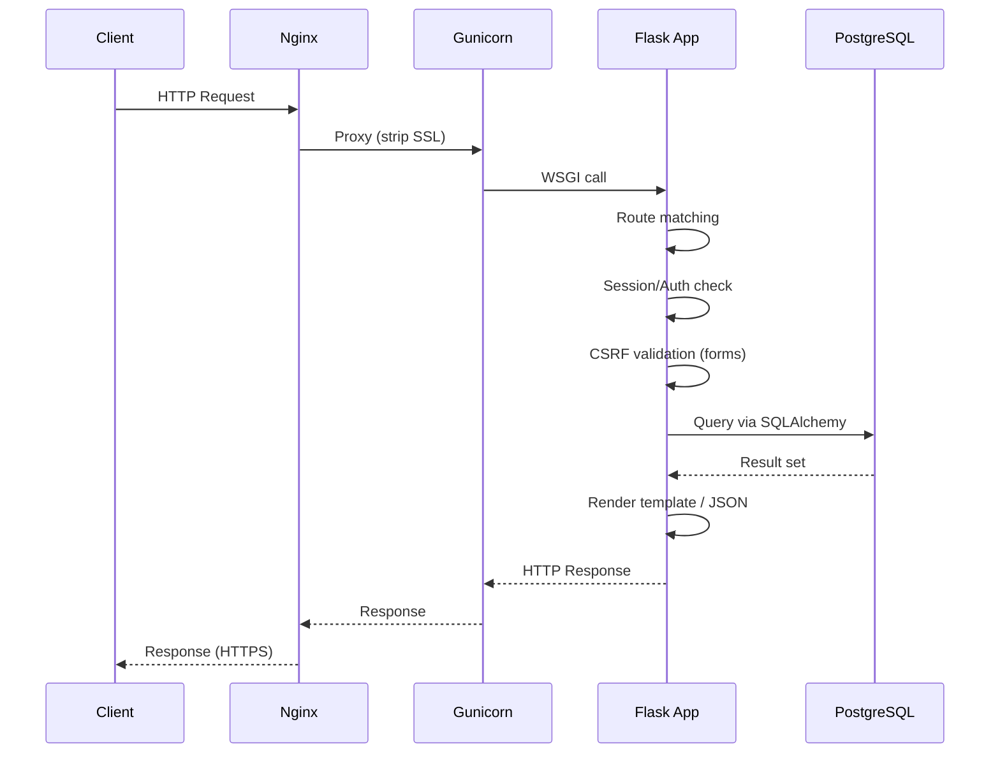
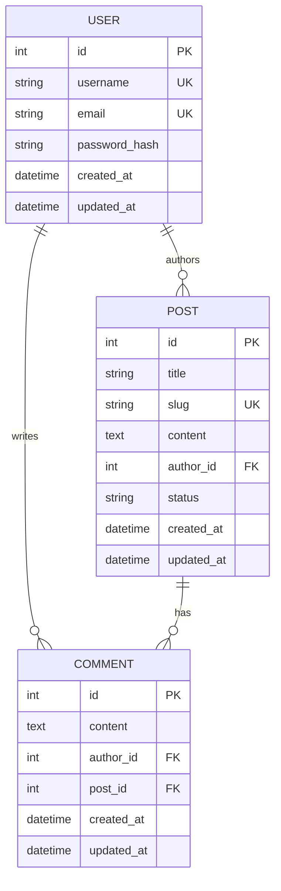

# Design Document: Personal Blog

## Overview

This document defines the technical design for a personal blogging platform built with Python Flask and PostgreSQL. The application follows a monolithic architecture with server-rendered HTML views and a REST API layer. It uses Flask's extension ecosystem (Flask-Login, Flask-WTF, Flask-Migrate, Flask-SQLAlchemy) to provide authentication, CSRF protection, database migrations, and ORM capabilities.

The system is designed for single-developer deployment on AWS behind Nginx with Gunicorn as the WSGI server.

### Key Design Decisions

1. **Application Factory Pattern**: Use `create_app()` factory to support multiple configurations (dev, test, prod) and enable isolated testing.
2. **Blueprints for Route Organization**: Separate concerns into `auth`, `blog`, `api` blueprints for maintainability.
3. **SQLAlchemy ORM with Flask-Migrate**: Declarative models with Alembic-managed schema evolution.
4. **Server-side Sessions via Flask-Login**: Stateful session management with configurable timeouts.
5. **WTForms for Validation**: Centralized form validation with CSRF protection via Flask-WTF.
6. **Bootstrap 5 via CDN**: No build tooling needed; responsive UI out of the box.

## Architecture

### High-Level Architecture



### Request Flow



### Directory Structure

```
rajblog/
├── app/
│   ├── __init__.py          # Application factory (create_app)
│   ├── config.py            # Configuration classes
│   ├── extensions.py        # Extension initialization (db, migrate, login, csrf)
│   ├── models/
│   │   ├── __init__.py
│   │   ├── user.py          # User model
│   │   ├── post.py          # Post model
│   │   └── comment.py       # Comment model
│   ├── auth/
│   │   ├── __init__.py      # Auth blueprint
│   │   ├── routes.py        # Login, register, logout routes
│   │   └── forms.py         # LoginForm, RegistrationForm
│   ├── blog/
│   │   ├── __init__.py      # Blog blueprint
│   │   ├── routes.py        # Post CRUD, comment, dashboard routes
│   │   └── forms.py         # PostForm, CommentForm
│   ├── api/
│   │   ├── __init__.py      # API blueprint
│   │   └── routes.py        # REST endpoints
│   ├── templates/
│   │   ├── base.html
│   │   ├── index.html
│   │   ├── auth/
│   │   │   ├── login.html
│   │   │   └── register.html
│   │   ├── blog/
│   │   │   ├── dashboard.html
│   │   │   ├── post_detail.html
│   │   │   ├── create_post.html
│   │   │   ├── edit_post.html
│   │   │   └── profile.html
│   │   └── errors/
│   │       ├── 404.html
│   │       ├── 403.html
│   │       └── 500.html
│   ├── static/
│   │   └── css/
│   │       └── style.css    # Custom styles
│   └── utils.py             # Utility functions (slug generation)
├── migrations/              # Alembic migration scripts
├── tests/
│   ├── conftest.py          # Test fixtures
│   ├── test_auth.py         # Auth tests
│   ├── test_blog.py         # Blog post tests
│   ├── test_comments.py     # Comment tests
│   ├── test_api.py          # API endpoint tests
│   └── test_errors.py       # Error handling tests
├── deployment/
│   ├── gunicorn.conf.py     # Gunicorn configuration
│   └── nginx.conf           # Nginx configuration
├── .env.example
├── .gitignore
├── requirements.txt
├── README.md
└── wsgi.py                  # WSGI entry point
```

## Components and Interfaces

### 1. Application Factory (`app/__init__.py`)

```python
def create_app(config_name: str = None) -> Flask:
    """
    Creates and configures the Flask application instance.
    
    Args:
        config_name: One of 'development', 'testing', 'production'.
                     Defaults to FLASK_ENV environment variable.
    
    Returns:
        Configured Flask application instance.
    """
```

Responsibilities:
- Load configuration based on environment
- Initialize extensions (db, migrate, login_manager, csrf)
- Register blueprints (auth, blog, api)
- Register error handlers (404, 403, 500)
- Configure logging for production

### 2. Configuration (`app/config.py`)

```python
class Config:
    """Base configuration shared across all environments."""
    SECRET_KEY: str                    # From env var
    SQLALCHEMY_TRACK_MODIFICATIONS: bool = False
    PERMANENT_SESSION_LIFETIME: timedelta = timedelta(hours=24)
    SESSION_INACTIVITY_TIMEOUT: int = 1800  # 30 minutes in seconds

class DevelopmentConfig(Config):
    DEBUG: bool = True
    SQLALCHEMY_DATABASE_URI: str = "postgresql://localhost/rajblog_dev"

class TestingConfig(Config):
    TESTING: bool = True
    SQLALCHEMY_DATABASE_URI: str = "postgresql://localhost/rajblog_test"
    WTF_CSRF_ENABLED: bool = False

class ProductionConfig(Config):
    DEBUG: bool = False
    SQLALCHEMY_DATABASE_URI: str      # From env var, required
    SESSION_COOKIE_HTTPONLY: bool = True
    SESSION_COOKIE_SECURE: bool = True
```

### 3. Extensions (`app/extensions.py`)

Centralizes extension instantiation for clean imports:

```python
from flask_sqlalchemy import SQLAlchemy
from flask_migrate import Migrate
from flask_login import LoginManager
from flask_wtf.csrf import CSRFProtect

db = SQLAlchemy()
migrate = Migrate()
login_manager = LoginManager()
csrf = CSRFProtect()
```

### 4. Auth Blueprint (`app/auth/`)

**Routes:**

| Method | Path | Handler | Auth | Description |
|--------|------|---------|------|-------------|
| GET/POST | `/register` | `register()` | Public | Registration form |
| GET/POST | `/login` | `login()` | Public | Login form |
| GET | `/logout` | `logout()` | Required | End session |

**Forms:**

- `RegistrationForm`: username (3-30 chars, alphanumeric+_-), email (valid format, ≤254 chars), password (8-128 chars), confirm_password
- `LoginForm`: email, password

### 5. Blog Blueprint (`app/blog/`)

**Routes:**

| Method | Path | Handler | Auth | Description |
|--------|------|---------|------|-------------|
| GET | `/` | `index()` | Public | Paginated post listing |
| GET | `/post/<slug>` | `post_detail()` | Public | Single post view |
| GET/POST | `/post/new` | `create_post()` | Required | Create post |
| GET/POST | `/post/<slug>/edit` | `edit_post()` | Owner | Edit post |
| POST | `/post/<slug>/delete` | `delete_post()` | Owner | Delete post |
| POST | `/post/<slug>/comment` | `add_comment()` | Required | Add comment |
| GET | `/dashboard` | `dashboard()` | Required | User dashboard |
| GET | `/profile` | `profile()` | Required | User profile |

### 6. API Blueprint (`app/api/`)

**Routes:**

| Method | Path | Auth | Request Body | Response |
|--------|------|------|-------------|----------|
| GET | `/api/posts` | Public | — | JSON array of published posts |
| GET | `/api/posts/<id>` | Public | — | JSON post detail |
| POST | `/api/posts` | Required | `{title, content}` | 201 + JSON post |
| PUT | `/api/posts/<id>` | Owner | `{title?, content?, status?}` | 200 + JSON post |
| DELETE | `/api/posts/<id>` | Owner | — | 204 No Content |
| POST | `/api/posts/<id>/comments` | Required | `{content}` | 201 + JSON comment |

**Error Responses (JSON):**
```json
{"error": "message describing the issue"}
```

- 400: Validation failure or malformed body
- 401: Authentication required
- 403: Forbidden (not owner)
- 404: Resource not found

### 7. Utility Functions (`app/utils.py`)

```python
def generate_slug(title: str, existing_slugs: list[str] | None = None) -> str:
    """
    Generate a URL-friendly slug from a post title.
    
    Algorithm:
    1. Convert to lowercase
    2. Replace spaces and consecutive whitespace with single hyphen
    3. Remove characters that are not lowercase letters, digits, or hyphens
    4. Trim leading/trailing hyphens
    5. If slug exists in existing_slugs, append numeric suffix (-1, -2, ...)
    
    Args:
        title: The post title to slugify.
        existing_slugs: List of slugs already in use (for deduplication).
    
    Returns:
        A unique, URL-friendly slug string.
    """

def validate_email(email: str) -> bool:
    """
    Validate email format: exactly one @ followed by domain with at least one dot.
    Total length must not exceed 254 characters.
    """

def validate_username(username: str) -> tuple[bool, str | None]:
    """
    Validate username: 3-30 chars, letters/digits/underscores/hyphens only.
    Returns (is_valid, error_message).
    """

def sanitize_input(text: str) -> str:
    """
    Strip leading/trailing whitespace. Reject if contains unescaped HTML tags.
    """
```

## Data Models

### Entity Relationship Diagram



### SQLAlchemy Model Definitions

**User Model:**
```python
class User(db.Model, UserMixin):
    __tablename__ = 'users'
    
    id = db.Column(db.Integer, primary_key=True)
    username = db.Column(db.String(30), unique=True, nullable=False, index=True)
    email = db.Column(db.String(254), unique=True, nullable=False, index=True)
    password_hash = db.Column(db.String(256), nullable=False)
    created_at = db.Column(db.DateTime, nullable=False, default=datetime.utcnow)
    updated_at = db.Column(db.DateTime, nullable=False, default=datetime.utcnow, onupdate=datetime.utcnow)
    
    posts = db.relationship('Post', backref='author', lazy='dynamic', cascade='all, delete-orphan')
    comments = db.relationship('Comment', backref='author', lazy='dynamic', cascade='all, delete-orphan')
    
    def set_password(self, password: str) -> None: ...
    def check_password(self, password: str) -> bool: ...
```

**Post Model:**
```python
class Post(db.Model):
    __tablename__ = 'posts'
    
    id = db.Column(db.Integer, primary_key=True)
    title = db.Column(db.String(200), nullable=False)
    slug = db.Column(db.String(250), unique=True, nullable=False, index=True)
    content = db.Column(db.Text, nullable=False)
    author_id = db.Column(db.Integer, db.ForeignKey('users.id'), nullable=False)
    status = db.Column(db.String(20), nullable=False, default='draft')
    created_at = db.Column(db.DateTime, nullable=False, default=datetime.utcnow)
    updated_at = db.Column(db.DateTime, nullable=False, default=datetime.utcnow, onupdate=datetime.utcnow)
    
    comments = db.relationship('Comment', backref='post', lazy='dynamic', cascade='all, delete-orphan')
    
    @property
    def excerpt(self) -> str:
        """Return first 200 characters of content."""
        return self.content[:200]
```

**Comment Model:**
```python
class Comment(db.Model):
    __tablename__ = 'comments'
    
    id = db.Column(db.Integer, primary_key=True)
    content = db.Column(db.Text, nullable=False)
    author_id = db.Column(db.Integer, db.ForeignKey('users.id'), nullable=False)
    post_id = db.Column(db.Integer, db.ForeignKey('posts.id'), nullable=False)
    created_at = db.Column(db.DateTime, nullable=False, default=datetime.utcnow)
    updated_at = db.Column(db.DateTime, nullable=False, default=datetime.utcnow, onupdate=datetime.utcnow)
```

### API Serialization

Posts and comments serialize to JSON dictionaries for API responses:

```python
def post_to_dict(post: Post, include_content: bool = True) -> dict:
    """Serialize a Post to a dictionary for JSON response."""
    result = {
        'id': post.id,
        'title': post.title,
        'slug': post.slug,
        'author': post.author.username,
        'status': post.status,
        'created_at': post.created_at.isoformat(),
        'updated_at': post.updated_at.isoformat(),
    }
    if include_content:
        result['content'] = post.content
    else:
        result['content_excerpt'] = post.excerpt
    return result

def comment_to_dict(comment: Comment) -> dict:
    """Serialize a Comment to a dictionary for JSON response."""
    return {
        'id': comment.id,
        'content': comment.content,
        'author': comment.author.username,
        'post_id': comment.post_id,
        'created_at': comment.created_at.isoformat(),
        'updated_at': comment.updated_at.isoformat(),
    }
```


## Correctness Properties

*A property is a characteristic or behavior that should hold true across all valid executions of a system—essentially, a formal statement about what the system should do. Properties serve as the bridge between human-readable specifications and machine-verifiable correctness guarantees.*

### Property 1: Slug generation produces valid URL-safe strings

*For any* string used as a post title, the `generate_slug` function SHALL produce a string that:
- Contains only lowercase letters (a-z), digits (0-9), and hyphens (-)
- Does not start or end with a hyphen
- Contains no consecutive hyphens
- Is non-empty (given a title with at least one alphanumeric character)

**Validates: Requirements 3.3**

### Property 2: Slug uniqueness with suffix

*For any* title that generates a slug already present in an existing set of slugs, the `generate_slug` function SHALL produce a unique slug by appending a numeric suffix (-1, -2, ...) such that the result is not in the existing set.

**Validates: Requirements 3.3**

### Property 3: Username validation correctness

*For any* string, `validate_username` SHALL return valid if and only if the string is between 3 and 30 characters in length (inclusive) and contains only letters, digits, underscores, or hyphens.

**Validates: Requirements 1.7**

### Property 4: Email validation correctness

*For any* string, `validate_email` SHALL return valid if and only if the string contains exactly one `@` character, the portion after `@` contains at least one dot, and the total length does not exceed 254 characters.

**Validates: Requirements 1.8**

### Property 5: Password hashing round-trip

*For any* valid password string (8-128 characters), calling `set_password` followed by `check_password` with the same string SHALL return True, and the stored `password_hash` SHALL never equal the plaintext password.

**Validates: Requirements 1.6, 2.1**

### Property 6: Public visibility invariant

*For any* collection of Posts with mixed statuses ("draft" and "published"), the public post listing and the GET /api/posts endpoint SHALL return only Posts whose status is "published" — no draft Post SHALL appear in public results.

**Validates: Requirements 4.4, 4.5, 7.1**

### Property 7: Comment content validation and normalization

*For any* string submitted as comment content, the system SHALL accept it if and only if, after trimming leading and trailing whitespace, the resulting string has length between 1 and 2000 characters (inclusive). Accepted content SHALL be stored with leading and trailing whitespace removed.

**Validates: Requirements 5.1, 5.2**

### Property 8: Post serialization completeness

*For any* Post model instance, `post_to_dict(post, include_content=True)` SHALL produce a dictionary containing exactly the keys: id, title, slug, content, author, status, created_at, updated_at — with values matching the corresponding model attributes.

**Validates: Requirements 7.1, 7.2**

## Error Handling

### Strategy

The application uses a layered error handling approach:

1. **Form Validation Layer** (WTForms): Catches input errors before they reach the database. Returns errors inline on the same form page with retained input.

2. **Application Layer** (Route handlers): Catches authorization errors, missing resources, and business logic violations. Returns appropriate HTTP error codes.

3. **Database Layer** (SQLAlchemy): Catches constraint violations (unique, not-null). Rolls back transactions on error.

4. **Global Error Handlers**: Catches unhandled exceptions and returns custom error pages.

### Error Response Patterns

**HTML Views (Browser):**
- Validation errors: Re-render form with error messages and retained input
- 403: Custom forbidden page with link to home
- 404: Custom not-found page with link to home
- 500: Custom server error page (no stack trace) with link to home
- Flash messages for success/failure notifications

**API Endpoints (JSON):**
```python
# Standard error response format
{"error": "Human-readable error message"}

# Status codes:
# 400 - Validation failure, malformed body
# 401 - Authentication required
# 403 - Forbidden (not resource owner)
# 404 - Resource not found
# 500 - Internal server error (generic message)
```

### Error Handler Registration

```python
@app.errorhandler(404)
def not_found_error(error):
    if request.path.startswith('/api/'):
        return jsonify({'error': 'Resource not found'}), 404
    return render_template('errors/404.html'), 404

@app.errorhandler(403)
def forbidden_error(error):
    if request.path.startswith('/api/'):
        return jsonify({'error': 'Forbidden'}), 403
    return render_template('errors/403.html'), 403

@app.errorhandler(500)
def internal_error(error):
    db.session.rollback()
    if request.path.startswith('/api/'):
        return jsonify({'error': 'Internal server error'}), 500
    return render_template('errors/500.html'), 500
```

### Production Logging

In production mode, unhandled exceptions are logged with full stack traces to the server log via Python's `logging` module with a `RotatingFileHandler`. The custom 500 page is shown to the user without any internal details.

### Input Validation Rules

| Field | Constraints | Error Behavior |
|-------|------------|----------------|
| Username | 3-30 chars, [a-zA-Z0-9_-] | Form error, retain input |
| Email | Valid format, ≤254 chars, unique | Form error, retain input |
| Password | 8-128 chars | Form error, retain input |
| Post title | 1-200 chars, non-empty | Form error, retain input |
| Post content | Non-empty | Form error, retain input |
| Post status | "draft" or "published" only | Form error, retain input |
| Comment content | 1-2000 chars after trim, non-whitespace-only | Form error, retain input |

## Testing Strategy

### Framework and Tools

- **Test Framework**: pytest
- **Property-Based Testing**: Hypothesis (Python PBT library)
- **Test Client**: Flask's built-in test client
- **Database**: Separate PostgreSQL test database (`rajblog_test`)
- **Fixtures**: pytest fixtures with transaction rollback for isolation

### Test Structure

```
tests/
├── conftest.py           # App factory, test client, database fixtures
├── test_auth.py          # Registration, login, logout
├── test_blog.py          # Post CRUD, dashboard, profile
├── test_comments.py      # Comment creation, validation
├── test_api.py           # REST API endpoints
├── test_errors.py        # Error pages and handling
└── properties/
    ├── test_slug.py      # Property tests for slug generation
    ├── test_validation.py # Property tests for input validation
    ├── test_visibility.py # Property tests for visibility rules
    └── test_serialization.py # Property tests for API serialization
```

### Test Fixtures (`conftest.py`)

```python
@pytest.fixture
def app():
    """Create application configured for testing."""
    app = create_app('testing')
    with app.app_context():
        db.create_all()
        yield app
        db.session.rollback()
        db.drop_all()

@pytest.fixture
def client(app):
    """Flask test client."""
    return app.test_client()

@pytest.fixture
def auth_client(client, sample_user):
    """Authenticated test client."""
    client.post('/login', data={'email': sample_user.email, 'password': 'testpass123'})
    return client
```

### Unit Tests

Unit tests verify specific examples and edge cases:

- **Auth tests**: Successful registration, login, logout; duplicate username/email; empty fields; invalid format
- **Blog tests**: Create, edit, delete posts; authorization checks; slug generation edge cases
- **Comment tests**: Valid/invalid submissions; display ordering; auth-gated form
- **API tests**: CRUD operations; error responses (400, 401, 403, 404)
- **Error tests**: Custom error pages; no stack trace in 500

### Property-Based Tests

Property tests use Hypothesis to verify universal invariants with 100+ generated inputs per property.

**Configuration:**
- Minimum 100 examples per property test (Hypothesis `settings(max_examples=100)`)
- Each test references its design property via tagged comment

**Example Property Test:**
```python
from hypothesis import given, settings
from hypothesis.strategies import text, integers

# Feature: personal-blog, Property 1: Slug generation produces valid URL-safe strings
@settings(max_examples=100)
@given(title=text(min_size=1, alphabet=string.ascii_letters + string.digits + ' '))
def test_slug_contains_only_valid_characters(title):
    slug = generate_slug(title)
    assert all(c in 'abcdefghijklmnopqrstuvwxyz0123456789-' for c in slug)
    if slug:
        assert slug[0] != '-'
        assert slug[-1] != '-'
        assert '--' not in slug
```

### Test Coverage Goals

| Area | Unit Tests | Property Tests |
|------|-----------|----------------|
| Slug generation | Edge cases (empty, special chars) | Properties 1, 2 |
| Username validation | Boundary values | Property 3 |
| Email validation | Known valid/invalid | Property 4 |
| Password hashing | Specific examples | Property 5 |
| Post visibility | Draft/published scenarios | Property 6 |
| Comment validation | Boundary lengths | Property 7 |
| API serialization | Specific post types | Property 8 |
| Authorization | Owner/non-owner pairs | Example-based |
| Error handling | Each error type | Example-based |

### Running Tests

```bash
# Run all tests
pytest

# Run only property tests
pytest tests/properties/

# Run with verbose output
pytest -v

# Run with coverage
pytest --cov=app --cov-report=html
```
